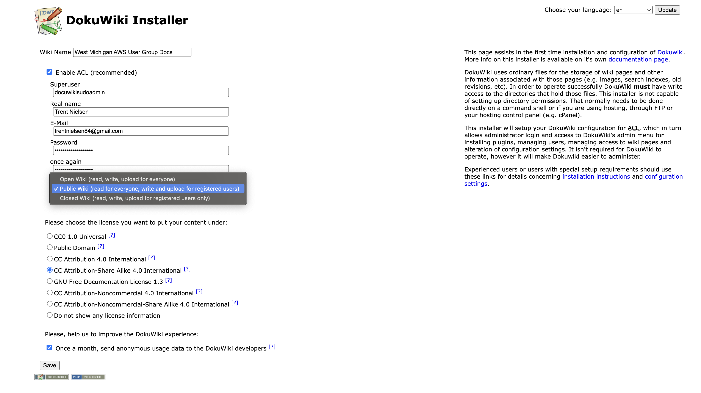

# Welcome to your CDK DocuWiki project

This is a repo for storing the DocuWiki application deployed on AWS. 

The `cdk.json` file tells the CDK Toolkit how to execute your app.

## Useful commands

* `npm run build`   compile typescript to js
* `npm run watch`   watch for changes and compile
* `npm run test`    perform the jest unit tests
* `npx cdk deploy`  deploy this stack to your default AWS account/region
* `npx cdk diff`    compare deployed stack with current state
* `npx cdk synth`   emits the synthesized CloudFormation template

# Deployment
This stack has an account number parameter you will need to pass in at deploy time.

```shell
AWS_DEFAULT_PROFILE=account-alias npx cdk deploy --parameters accountNumberParam=123456789123
```

# DocuWiki on AWS
- Linuxserver.io container image of DocuWiki
- Deployed on ECS Fargate w/ EFS for file persistence
- After deployment, set up DocuWiki by visiting the ALB address and setting up credentials https://www.dokuwiki.org/installer


This app is configured with ECS exec. Initial setup requires configuration of user credentials, which can be accomplished
via a bash shell in the ECS Fargate container.  [Install the SSM plugin, for the AWS CLI](https://docs.aws.amazon.com/systems-manager/latest/userguide/session-manager-working-with-install-plugin.html).

To log into the container, use the following command after deploying CDK
```
./ecs-exec.sh <ecsClusterId>
```

